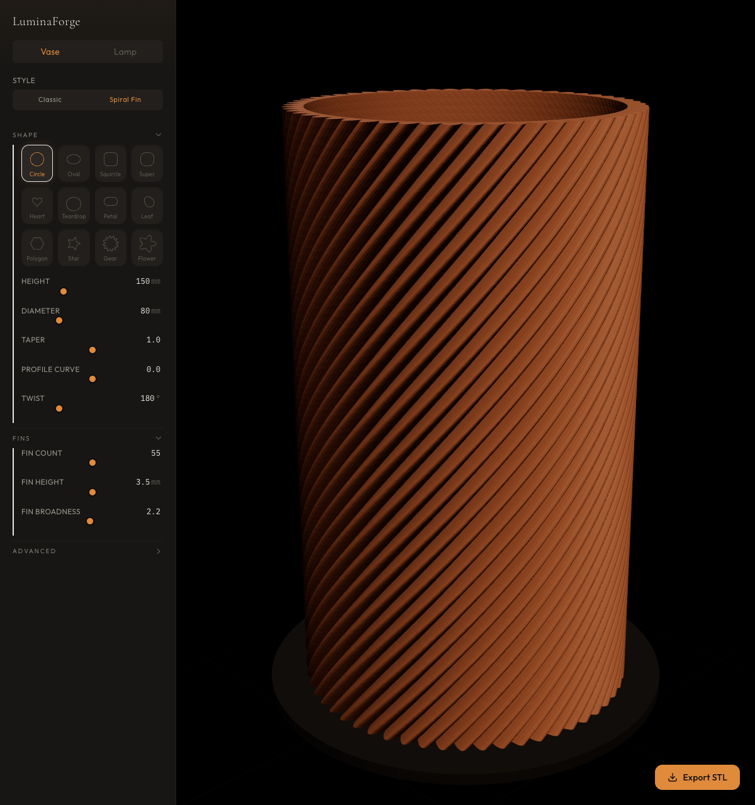

# LuminaForge

Parametric vase and lamp designer for 3D printing. You tweak sliders, a vase appears in real time, you export an STL.



## What's in here

A browser-based editor where you design printable vases by adjusting parameters: height, diameter, twist, profile curve, fin count, and so on. Geometry generates client-side in a Web Worker, so there's no server round-trip. You see results as you drag.

Two vase styles so far:

- **Classic** -- twisted ridges along the outer wall
- **Spiral fin** -- raised fins that spiral around the body (the default, and the more interesting one)

12 cross-section shapes: circle, oval, squircle, superellipse, heart, teardrop, petal, leaf, polygon, star, gear, flower. Each has its own sub-parameters (oval ratio, polygon sides, star inner ratio, etc).

When you're happy with how it looks, hit Export STL. The file downloads at full resolution, ready for your slicer.

## Quick start

```bash
# Node 20+
git clone <repo-url>
cd luminaforge
npm install
PORT=3001 npm run dev
```

Open http://localhost:3001/editor.

## How it works

Parameter changes flow through a straightforward pipeline:

1. You move a slider
2. Zustand store updates
3. After 150ms debounce, the Web Worker gets called
4. JSCAD (`@jscad/modeling`) generates the vase geometry as a Geom3
5. Geometry converts to positions/normals/indices arrays
6. Three.js (via React Three Fiber) renders it in the viewport

All geometry math runs off the main thread. The UI stays responsive even while JSCAD crunches through boolean operations for the hollow interior.

For STL export, serialization also happens in the worker. You get back an ArrayBuffer, which downloads as a Blob.

## Project structure

```
src/
  app/                  Next.js pages (landing, editor)
  generators/
    vase/               Geometry generation (pure functions)
      vaseGenerator.ts  Main vase logic
      crossSections.ts  12 cross-section shape generators
      profiles.ts       Profile curves and twist easing
    shared/             Geom3 -> Three.js buffer conversion
    worker.ts           Web Worker entry (Comlink)
  components/
    parameters/         Sliders, toggles, cross-section picker
    viewport/           R3F canvas, lighting, camera, model renderer
    editor/             Layout shell
  store/                Zustand stores (design params, viewport state)
  hooks/                useGeometryWorker, useMediaQuery
  types/                TypeScript definitions for all params
```

## Scripts

| Command | What it does |
|---|---|
| `PORT=3001 npm run dev` | Dev server |
| `npm run build` | Production build |
| `npm run test` | Vitest (283 tests) |
| `npm run typecheck` | TypeScript strict mode |
| `npm run lint` | ESLint |

## Tech

- Next.js 14 (App Router, TypeScript strict)
- Three.js via React Three Fiber + drei
- @jscad/modeling for CSG geometry
- Zustand for state
- Tailwind CSS, dark theme with warm amber accents
- Comlink for Web Worker communication
- Vitest + React Testing Library

## Status

This is early. The vase generator works and you can export real STL files for printing. 283 tests pass.

Still to come: lamp generator, presets gallery, user accounts, share links.

## Design

Dark theme. Amber accent (#E08A3C). Cormorant Garamond for display type, Outfit for UI text, IBM Plex Mono for parameter values.

Responsive: sidebar on desktop, bottom sheet on mobile.
